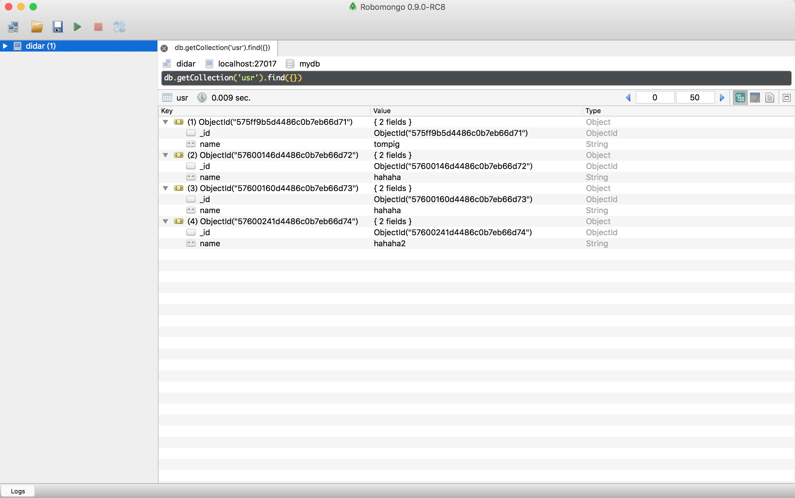
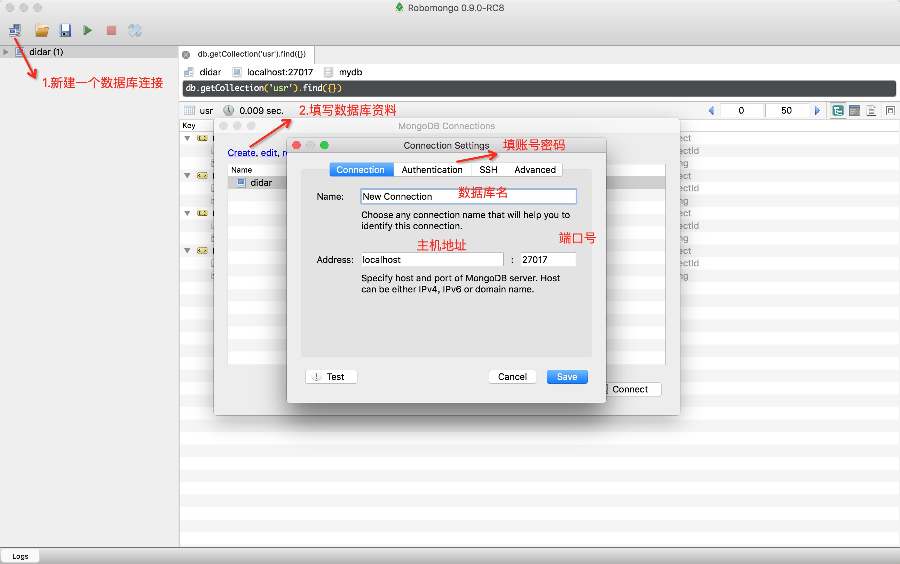

# MongoDB简介
MongoDB 是一个基于分布式文件存储的 NoSQL（非关系型数据库）的一种，由 C++ 语言编写，旨在为 WEB 应用提供可扩展的高性能数据存储解决方案。MongoDB 支持的数据结构非常松散，是类似 json 的 bjson 格式，因此可以存储比较复杂的数据类型。MongoDB 最大的特点是他支持的查询语言非常强大，其语法有点类似于面向对象的查询语言，几乎可以实现类似关系数据库单表查询的绝大部分功能，而且还支持对数据建立索引。

MongoDB 没有关系型数据库中行和表的概念，不过有类似的文档和集合的概念。文档是 MongoDB 最基本的单位，每个文档都会以唯一的 _id 标识，文档的属性为 key/value 的键值对形式，文档内可以嵌套另一个文档，因此可以存储比较复杂的数据类型。集合是许多文档的总和，一个数据库可以有多个集合，一个集合可以有多个文档。

更多有关 MongoDB 的知识请参阅 《mongodb权威指南》或查阅：http://www.mongodb.org/

## 1.Mac下安装mongoDB

如果已装brew，更新最新版

```
brew update
```
如果未装brew，安装brew

```
ruby -e "$(curl -fsSL https://raw.githubusercontent.com/Homebrew/install/master/install)"
```

安装mongodb

```
brew install mongodb
```

更多其他方法：https://docs.mongodb.org/manual/installation/

## 2.启动数据库
``` sh
mongod
```
``` sh
ChuangtaizhaodeMacBook-Pro:tvvt huangtaizhao$ mongod
2016-06-14T16:16:01.608+0800 I CONTROL  [initandlisten] MongoDB starting : pid=7421 port=27017 dbpath=/data/db 64-bit host=huangtaizhaodeMacBook-Pro.local
2016-06-14T16:16:01.610+0800 I CONTROL  [initandlisten] db version v3.2.0
2016-06-14T16:16:01.610+0800 I CONTROL  [initandlisten] git version: 45d947729a0315accb6d4f15a6b06be6d9c19fe7
2016-06-14T16:16:01.610+0800 I CONTROL  [initandlisten] allocator: system
2016-06-14T16:16:01.610+0800 I CONTROL  [initandlisten] modules: none
2016-06-14T16:16:01.610+0800 I CONTROL  [initandlisten] build environment:
2016-06-14T16:16:01.610+0800 I CONTROL  [initandlisten]     distarch: x86_64
2016-06-14T16:16:01.610+0800 I CONTROL  [initandlisten]     target_arch: x86_64
2016-06-14T16:16:01.610+0800 I CONTROL  [initandlisten] options: {}
2016-06-14T16:16:01.613+0800 I STORAGE  [initandlisten] exception in initAndListen: 29 Data directory /data/db not found., terminating
2016-06-14T16:16:01.613+0800 I CONTROL  [initandlisten] dbexit:  rc: 100
```

不加任何参数时，db默认保存在/data/db目录(如果该目录不存在，启动会报错)，监听的端口是27017，且不启动安全认证机制(即：谁都可以连接，只要连接上来的用户都是管理员）。

## 3.指定数据库目录

``` sh
mongod --dbpath ~/data/db/mongo
//mongod --dbpath 《自定义路径》
```

``` sh
huangtaizhaodeMacBook-Pro:tvvt huangtaizhao$ mongod --dbpath ~/work/task/didar/data/mongo
2016-06-14T20:49:27.786+0800 I CONTROL  [initandlisten] MongoDB starting : pid=7784 port=27017 dbpath=/Users/huangtaizhao/work/task/didar/data/mongo 64-bit host=huangtaizhaodeMacBook-Pro.local
```

### 3.1指定端口号
``` sh
mongod --dbpath ~/data/db/mongo --port 12345
```

### 3.2更多命令

``` sh
mongod --help
```

## 4.使用

启动成功后，可以用 mongo 命令来连接
``` sh
mongo
```
然后就可以直接使用各种命令来操作db了。

### 4.1 新建数据库

新建一个数据库：

``` sh
use mydb
```

### 4.2 安全验证

刚才我们启动数据库时，是直接采取默认的启动方式，不带任何验证。不带--auth的启动方式是很可怕的，没有任何安全控制，一般只限于开发环境。生产环境肯定要开启安全认证，mongodb在安全认证的主要思路是：

先在某个库上创建用户(db.createUser) -> 将该用户授权(db.auth) -> mongod启动时指定--auth选项 -> mongo客户端连接时指定用户名、密码、认证db（或者连接时先不指定用户名、密码，连接上以后，再用db.auth切换到认证用户身份）

``` sh
db.createUser({
 "user" : "admin",
 "pwd": "123456",              
 "roles" : ["readWrite","dbAdmin", "userAdmin"]
})

//名为admin的用户将具有具备读写、db管理、用户管理权限
```
更多权限类型，查看https://docs.mongodb.org/manual/reference/built-in-roles/#built-in-roles

授权用户给当前数据库
``` sh
db.auth({
   user: "admin",
   pwd: "123456"
}) 
```

重启数据库并加权限验证

``` sh
mongod --dbpath ~/work/task/didar/data/mongo --auth
```

验证用户权限

``` sh
db.auth("admin", '111111')
```
返回0，表示没有此用户，返回1，表示验证通过。


## CRUD 增删改查

### collection(集合)相关

``` sh
use dbName
```

#### 查看当前所使用的数据库名
``` sh
db
getName 

//db和getName方法是一样的效果，都可以查询当前使
```

#### 查看数据库所在host

``` sh
db.getMongo()
```

#### 新建一个集合(user)

``` sh
db.createCollection('user')
```

#### 删除一个集合(user)

``` sh
db.user.drop()
```

#### 在user集合里插入一条记录

``` sh
db.user.insert({'userName':"name",'productName':'iphone'})
```

#### 在user集合里查询一条记录

``` sh
db.user.find( <query filter>, <projection> )
```

#### 在user集合里更新一条记录

``` sh
db.user.update({"name": "ssss"})
```

#### 在user集合里删除一条记录

``` sh
db.user.remove({"name": "ssss"})
db.user.remove({"name": "ssss"}, 1) //删除结果集中的第一条
```

更多命令行方法，https://docs.mongodb.com/manual/tutorial/remove-documents/

## mongoDB可视化工具

推荐一款可视化工具：[Robomango](https://robomongo.org/download)

最新版本收费，但是过往版本不收费。

安装后界面如下：



使用方法：



接下来就不需要敲命令行那么麻烦了，可以直接用这个工具操作数据库，它也可以执行mongoDB shell。

## NodeJs中的mongoDB

虽然有mongoose这种工具，但我建议大家还是先熟悉熟悉使用node的mongoDB模块，熟悉了它的语法后，再用mongoose可以加深理解，以下讲介绍简单的nodejs对mongodb的基本操作。

### 安装

``` sh
npm install mongodb
```
### 连接数据库

``` js
var MongoClient = require('mongodb').MongoClient; //获取mongodb
var url = "mongodb://localhost:27017/mydb"; //连接本地数据库中的mydb这个库
MongoClient.connect(url, function(err, db) {

});
```
### insert 方法插入数据
``` js
var MongoClient = require('mongodb').MongoClient; //获取mongodb
var url = "mongodb://localhost:27017/mydb"; //连接本地数据库中的mydb这个库
MongoClient.connect(url, function(err, db) {
  console.log("连接成功！"); //成功， 命令行输出提示
  var collection = db.collection('users'); //连接users这张表
  //插入数据
  var data = [{"name":'wilson001',"age":21},{"name":'wilson002',"age":22}];
  // insert 方法插入
  collection.insert(data, function(err, result) { 
    if(err)
    {
      console.log('Error:'+ err); //错误，命令行输出提示
      return;
    }
    db.close(); //关闭数据库
  });
});
```

### remove 方法删除数据
``` js
var MongoClient = require('mongodb').MongoClient; //获取mongodb
var url = "mongodb://localhost:27017/mydb"; //连接本地数据库中的mydb这个库
MongoClient.connect(url, function(err, db) {
  console.log("连接成功！"); //成功， 命令行输出提示
  var collection = db.collection('users'); //连接users这张表
  //插入数据
  var data = {"name":'wilson001',"age":21};
  // remove 方法删除
  collection.remove(data, function(err, result) { 
    if(err)
    {
      console.log('Error:'+ err); //错误，命令行输出提示
      return;
    }
    db.close(); //关闭数据库
  });
});
```

### update 方法修改数据
``` js
var MongoClient = require('mongodb').MongoClient; //获取mongodb
var url = "mongodb://localhost:27017/mydb"; //连接本地数据库中的mydb这个库
MongoClient.connect(url, function(err, db) {
  console.log("连接成功！"); //成功， 命令行输出提示
  var collection = db.collection('users'); //连接users这张表
  //插入数据
  var originData = {"name":'wilson001'}; //源数据
  var updateData = {$set: {"age" : 100}}; //要修改的数据
  // update 方法删除
  collection.update(originData, updateData, function(err, result) { 
    if(err)
    {
      console.log('Error:'+ err); //错误，命令行输出提示
      return;
    }
    db.close(); //关闭数据库
  });
});
```

### findOne 方法查询数据
``` js
var MongoClient = require('mongodb').MongoClient; //获取mongodb
var url = "mongodb://localhost:27017/mydb"; //连接本地数据库中的mydb这个库
MongoClient.connect(url, function(err, db) {
  console.log("连接成功！"); //成功， 命令行输出提示
  var collection = db.collection('users'); //连接users这张表
  //插入数据
  var data = {"name":'wilson001'};
  // remove 方法删除
  collection.findOne(data, function(err, result) { 
    if(err)
    {
      console.log('Error:'+ err); //错误，命令行输出提示
      return;
    }
    db.close(); //关闭数据库
    return result; //返回查找的结果集
  });
});
```


